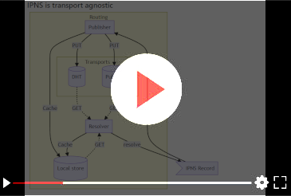

<h1 style="text-align:center">Info proyecto</h1>

>`[1]` Este proyecto tiene los datos suficientes para poder ejecutar el proyecto y crear una build para IPFS.
>
> `[2]` Todo aquello creado en este proyecto, es con fines educativos.
<HR>
</br>
</br>
<h1 style="text-align:center">Pasos a seguir</h1>

>`[1]` Instalar todos las dependencias
```
npm install 
```
> `[2]` Visualizar el proyecto previamente antes de generar la build
```
npm run start
```
> `[3]` Generar la build del proyecto
```
npm run build
```
> `[4]` El proyecto esta listo para subir a IPFS, recuerde que tiene que subir la carpeta
```
.\dist\todo-list
```
<HR>
</br>
</br>
<h1 style="text-align:center">Resultado Final en Web3</h1>

> </br>
> <p style="text-align:center">Enlace con gateway <a href="https://nftstorage.link/">https://nftstorage.link/</a> que es un gateway de <a href="https://dweb.link" target="_blank">IPFS</a></p>
>
> * CID: 
>
> ```
> bafybeibdftvo7kklnzn4zj7oocvn4enryl653y6kuqrofc6a3bj7rrlz2e
> ```
> </br>
>
> * URL COMPLETA: 
>
> ```
>https://nftstorage.link/ipfs/bafybeibdftvo7kklnzn4zj7oocvn4enryl653y6kuqrofc6a3bj7rrlz2e
> ```
> </br>
</br>
</br>
<HR>
</br>
</br>
<h1 style="text-align:center">IPNS</h1>

> </br>
> <p>IPNS es el protocolo que interconecta los DNS con la red de IPFS.</p></br>
> <p>Por lo tanto este apartado os explico de forma resumida como he externalizado y centralizado este proyecto para una mas fácil comprensión del usuario final, el acceso a este contenido.</p></br>
> <p>Para acabar, os dejo el código que hay que añadir en el mapa del DNS, de tipo TXT</p>
~~~~ HTML
"dnslink=/ipfs/<TU CID>"
~~~~
</br>
</br>
<HR>
</br>
</br>
<h1 style="text-align:center">video tutorial</h1>


[](./IPNS.mp4)

Enlaces de interes para esta explicación:


>
>`[1]` <a href="https://freedns.afraid.org/subdomain/">https://freedns.afraid.org/subdomain/</a>

>`[2]` <a href="https://ipfs.github.io/public-gateway-checker/">https://ipfs.github.io/public-gateway-checker/</a>

>`[3]` <a href="ipns://web3-tutorial-angular-by-genesislloret.ftp.sh">ipns://web3-tutorial-angular-by-genesislloret.ftp.sh</a>

>`[4]` <a href="https://dweb.link/ipns/web3-tutorial-angular-by-genesislloret.ftp.sh">https://dweb.link/ipns/web3-tutorial-angular-by-genesislloret.ftp.sh</a>

>`[5]` <a href="https://web3-angular-genesislloret.blogspot.com/">https://web3-angular-genesislloret.blogspot.com/</a></br>

<p>Para Blogger, el código utilizado en la plantilla es:</p>

~~~~ HTML
<!DOCTYPE html PUBLIC "-//W3C//DTD XHTML 1.0 Strict//EN" "http://www.w3.org/TR/xhtml1/DTD/xhtml1-strict.dtd">
<html xmlns="http://www.w3.org/1999/xhtml" xml:lang="en" lang="en" dir="<$BlogLanguageDirection$>">
<head><style>#navbar-iframe-container{display:none;}</style></head>
<body>
<!-- Begin #content - Centers all content and provides edges for floated columns -->
<div id="content">
<iframe src="https://<TU GATEWAY PREFERIDA>/ipns/<TU DOMINIO CON IPNS>" style="width:100vw;height:100vh;border:none;"/>
</div>
</body>
</html>
~~~~
